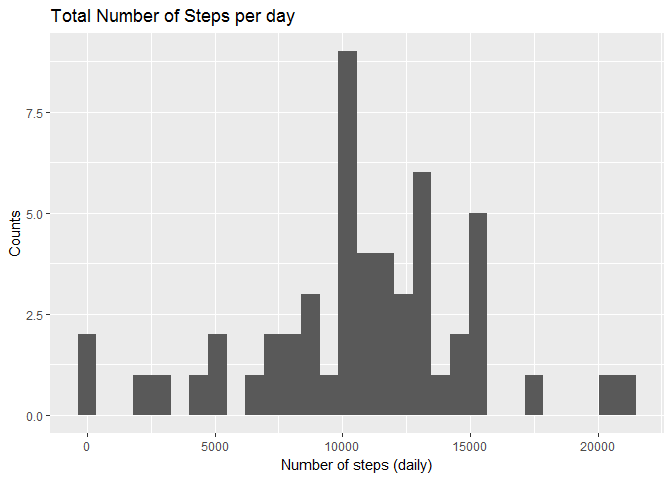
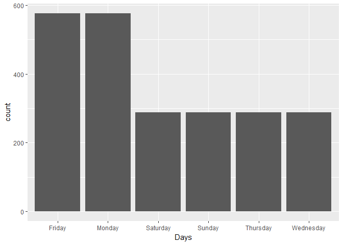
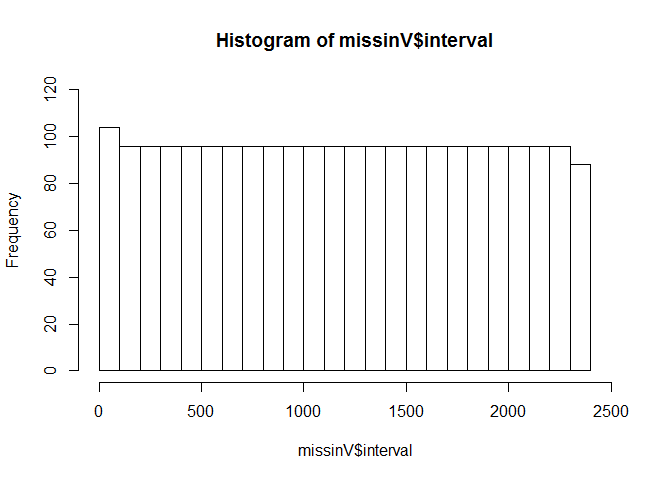
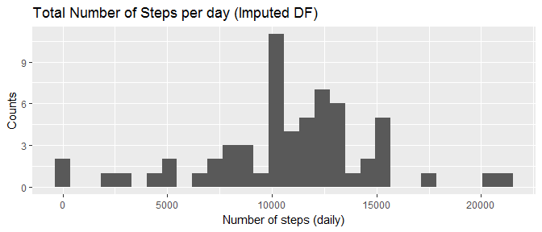
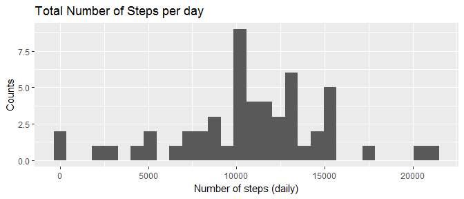

# Reproducible Research: Peer Assessment 1
Jonas J Torres  

###Load and Preprocess the data

#### Load Parameters and libraries
**Disclaimer: Before running this reproducible document, make sure that you have forked the corresponding repository, and have saved this script in the corresponding folder. **

We will first load the paremeters to read in the file.


```r
fileName <- "activity.csv"

library(ggplot2)
library(dplyr)
```

We´ll now proceed to read the file into a dataframe and have a quick look at the variable types.


```r
df <- read.csv(fileName, header = T)
str(df)
```

```
## 'data.frame':	17568 obs. of  3 variables:
##  $ steps   : int  NA NA NA NA NA NA NA NA NA NA ...
##  $ date    : Factor w/ 61 levels "2012-10-01","2012-10-02",..: 1 1 1 1 1 1 1 1 1 1 ...
##  $ interval: int  0 5 10 15 20 25 30 35 40 45 ...
```

#### Preprocessing

Before analyzing the dataset, we will convert the 'date' variable into date format.


```r
df$date <- as.Date(df$date, "%Y-%m-%d")
str(df)
```

```
## 'data.frame':	17568 obs. of  3 variables:
##  $ steps   : int  NA NA NA NA NA NA NA NA NA NA ...
##  $ date    : Date, format: "2012-10-01" "2012-10-01" ...
##  $ interval: int  0 5 10 15 20 25 30 35 40 45 ...
```

### What is the mean total number of steps taken per day?

#### Histogram of the total number of steps taken each day.


```r
grouped <- group_by(df, date)
grouped <- summarise_all(grouped, sum)
ggplot(grouped, aes(x = steps)) + geom_histogram(bins=30) + ggtitle("Total Number of Steps per day") +
    ylab("Counts") +
    xlab("Number of steps (daily)")
```



#### Mean and Median total number of steps taken per day


```r
print(paste0("Average number of steps per day: ",round(mean(grouped$steps, na.rm=T),0)))
```

```
## [1] "Average number of steps per day: 10766"
```

```r
print(paste0("Median number of steps per day: ",round(median(grouped$steps, na.rm=T),0)))
```

```
## [1] "Median number of steps per day: 10765"
```


### What is the average daily activity pattern?

#### Plot the 5 minute interval versus the average number of steps taken per day


```r
#Group observations by inverval
int_group <- select(df, steps, interval)
int_group <- group_by(int_group, interval)
#Calculate the average number of steps by interval (use na.rm to handle missingness)
int_group <- summarise(int_group, AverageSteps = mean(steps, na.rm=T))

#plot(int_group$interval, int_group$AverageSteps, type ="l")
p <- ggplot(int_group, aes(x=interval, y=AverageSteps))
p + geom_line()+
    xlab("Intervals")+
    ylab("Average Steps")+
    ggtitle("Average Number of Steps by Interval")
```


#### Determine the Interval with maximum average steps per day

We can see that the maximum average steps take place at the "8:35AM" time interval.


```r
index <- which.max(int_group$AverageSteps)
print(int_group[index,])
```

```
## # A tibble: 1 x 2
##   interval AverageSteps
##      <int>        <dbl>
## 1      835     206.1698
```

### Imputing Missing Values

#### Number of rows with missing values


```r
index <- !complete.cases(df)
summary(df)
```

```
##      steps             date               interval     
##  Min.   :  0.00   Min.   :2012-10-01   Min.   :   0.0  
##  1st Qu.:  0.00   1st Qu.:2012-10-16   1st Qu.: 588.8  
##  Median :  0.00   Median :2012-10-31   Median :1177.5  
##  Mean   : 37.38   Mean   :2012-10-31   Mean   :1177.5  
##  3rd Qu.: 12.00   3rd Qu.:2012-11-15   3rd Qu.:1766.2  
##  Max.   :806.00   Max.   :2012-11-30   Max.   :2355.0  
##  NA's   :2304
```

```r
print(paste0("Number of observations with missing values: ", sum(index)))
```

```
## [1] "Number of observations with missing values: 2304"
```

#### Imputing missing values

By reviewing the previous summary output, we can see that only the 'steps' variable contains missing values.

We will use either the mean or median to impute the missing values. Before settling for a one of those measures of center, we will explore the missingness to see if there is an underlying pattern.


```r
missinV <- df[index,]
missinV$Days <- weekdays(missinV$date)

p <- ggplot(missinV, aes(Days))

p + geom_bar()
```

<!-- -->

The missing values seem to be spread evenly across days, except for Friday and Monday which contain twice as much missing values than the rest of the days, and there are no missing values on Tuesdays.

Lets have a look at how the missingness relates to time intervals.


```r
hist(missinV$interval, breaks=30, xlim = c(0,2500),
     ylim=c(0,120))
```

<!-- -->

```r
summary(missinV$interval)
```

```
##    Min. 1st Qu.  Median    Mean 3rd Qu.    Max. 
##     0.0   588.8  1177.5  1177.5  1766.2  2355.0
```

The missingess seems to be uniformely distributed across intervals.


Not, lets review the five number summary of stops across days.


```r
df$Days <- weekdays(df$date)
tapply(df$steps, df$Days, summary)
```

```
## $Friday
##    Min. 1st Qu.  Median    Mean 3rd Qu.    Max.    NA's 
##    0.00    0.00    0.00   42.92   16.00  802.00     576 
## 
## $Monday
##    Min. 1st Qu.  Median    Mean 3rd Qu.    Max.    NA's 
##    0.00    0.00    0.00   34.63    7.00  789.00     576 
## 
## $Saturday
##    Min. 1st Qu.  Median    Mean 3rd Qu.    Max.    NA's 
##    0.00    0.00    0.00   43.53   22.00  785.00     288 
## 
## $Sunday
##    Min. 1st Qu.  Median    Mean 3rd Qu.    Max.    NA's 
##    0.00    0.00    0.00   42.63   26.00  785.00     288 
## 
## $Thursday
##    Min. 1st Qu.  Median    Mean 3rd Qu.    Max.    NA's 
##    0.00    0.00    0.00   28.52    0.00  759.00     288 
## 
## $Tuesday
##    Min. 1st Qu.  Median    Mean 3rd Qu.    Max. 
##    0.00    0.00    0.00   31.07    7.00  806.00 
## 
## $Wednesday
##    Min. 1st Qu.  Median    Mean 3rd Qu.    Max.    NA's 
##    0.00    0.00    0.00   40.94   13.00  766.00     288
```

The previous output shows that using the median, would replace every value by 0. This may not be very helpful since ~2300 additional zeros might significantly pull the mean. We will instead use the mean.

We could also observe that the fivenumber summary varied for each day, so we will just use the average value of each week day, to compute the missing values.


```r
#Create an array with the average step for each day
dayTable <- tapply(df$steps, df$Days, mean, na.rm=T)

#create a copy of the original data frame
imputed <- df

# create a boolean vector of NA observations
naIndex <- is.na(imputed$steps)

for(day in names(dayTable)){
    nameIndex <- imputed$Days == day
    imputed$steps[naIndex & nameIndex] <- dayTable[day]
}

# Check that there are no missing values in imputed DF
print(if_else(sum(!complete.cases(imputed)) > 0, "Missing Values in Imputed DF",
   "No Missing Values in Imputed DF"))
```

```
## [1] "No Missing Values in Imputed DF"
```

Now lets compare the distribution of the imputed data frame versus the data frame with missing values.


```r
imputedSub <- select(imputed, date, steps)
groupedImp <- group_by(imputedSub, date)
groupedImp <- summarise_all(groupedImp, sum)

p1 <- ggplot(groupedImp, aes(x = steps)) + geom_histogram(bins=30) + ggtitle("Total Number of Steps per day (Imputed DF)") +
    ylab("Counts") +
    xlab("Number of steps (daily)")


p2 <- ggplot(grouped, aes(x = steps)) + geom_histogram(bins=30) + ggtitle("Total Number of Steps per day") +
    ylab("Counts") +
    xlab("Number of steps (daily)")

p1;p2
```

<!-- --><!-- -->

By looking at the two histograms, we can see that the count of days with ~10000:~14000 steps has increased slightly, altough this does not seem to have affected the five number summary significantly.

Lets compare these stats.


```r
summary(df$steps)
```

```
##    Min. 1st Qu.  Median    Mean 3rd Qu.    Max.    NA's 
##    0.00    0.00    0.00   37.38   12.00  806.00    2304
```

```r
summary(imputed$steps)
```

```
##    Min. 1st Qu.  Median    Mean 3rd Qu.    Max. 
##    0.00    0.00    0.00   37.57   34.63  806.00
```
We observe that only the third quartile was significantly affected by the imputation, but this makes sense, since there are now 2304 additional values.


The table below compares the mean and median of the 'Imputed' and 'Non Imputed' data frames.


```r
mean_median = data.frame(DataFrame = 'Imputed',
                         Mean =round(mean(groupedImp$steps, na.rm=T),0),
                         Median = round(median(groupedImp$steps, na.rm=T),0))

mean_median <- rbind(mean_median,
                     data.frame(DataFrame = 'Non Imputed',
                         Mean =round(mean(grouped$steps, na.rm=T),0),
                         Median = round(median(grouped$steps, na.rm=T),0)))

mean_median
```

```
##     DataFrame  Mean Median
## 1     Imputed 10821  11015
## 2 Non Imputed 10766  10765
```

### Are there differences in activity patterns between weekdays and weekends?

#### Create a factor varible for weekdays/weekends and make a Panel Plot


```r
imputed$WeekSegment <- if_else(imputed$Days == "Saturday" | imputed$Days == "Sunday", "weekend", "weekday")

intImp <- select(imputed, interval, WeekSegment, steps)
intImp <- group_by(intImp, interval, WeekSegment)
intImp <- summarise_all(intImp, mean)

p <- ggplot(intImp, aes(x=interval, y=steps)) + 
    facet_grid(WeekSegment ~.)+
    geom_line() +
    xlab("Intervals")+
    ylab("Average Steps")+
    ggtitle("Average Number of Steps by Interval")
p
```


The results show that people tend to wake up later over the weekends and also that the average number of steps across intervals is more evenly distributed (there is no 'significant' peak).
